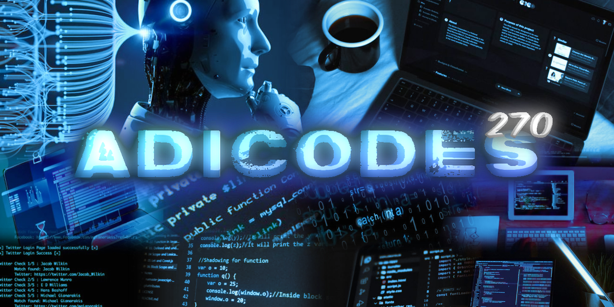

<h2 align="left">Hi 👋! My name is Aditya , Im a programmer from India</h2>

###

###

###

# 💻 Tech Stack:
       
# 📊 GitHub Stats:

  <!-- Alternative to nirzak for better reliability -->

---

###
